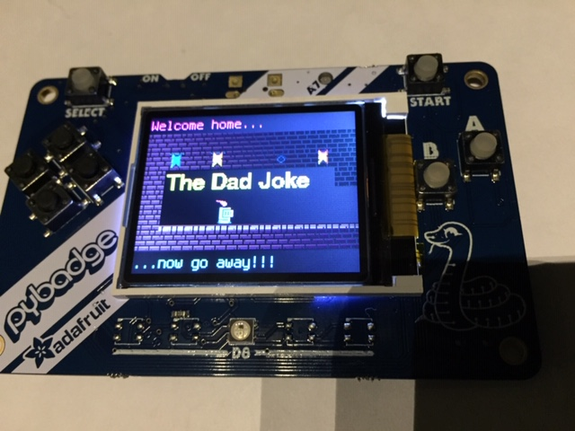

# CircuitDungeon - Chapter 3 - The Dad Joke (for PyBadge)

## prerequisites

* Works with [PyBadge](https://www.adafruit.com/product/4200) or [PyBadge LC](https://www.adafruit.com/product/3939)
* Update PyBadge to CircuitPython 4.0.1 or newer
* Copy to `.../CIRCUITPY/lib`:
  * `adafruit_bitmap_font`, `adafruit_display_text`
* Copy the `dad` directory here to `.../CIRCUITPY`.

## from the REPL

    from dad import joke
    game=joke.play()

## game controls

* `LEFT` and `RIGHT` buttons to move
* `B` button toggles armor
* Press `DOWN` and `B` at the same time to exit to REPL

## to run on startup

Copy the `main.py` file in the `dad` directory up to the top-level `CIRCUITPY` dir to make the game auto-start.

