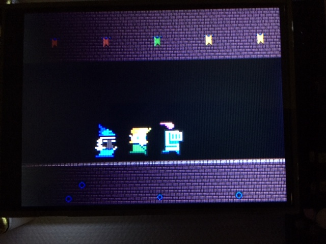

# CircuitDungeon - Chapter 4 - The Rabbit Hole

## prerequisites

* [CircuitPython](https://circuitpython.org/) 4.1.0 or greater
* tested with [HalloWing](https://www.adafruit.com/product/3900) and [PyPortal](https://www.adafruit.com/product/4116)
* Copy the `dungeon` directory here to `.../CIRCUITPY`.

## from the REPL

    from dungeon import demo
    g=demo.play()
