# Chapter 7 — Deploying to the PicoSystem

How to get `Chapter_7/game/` onto a Pimoroni PicoSystem and run it. Board
notes are in `Chapter_6/doc/SYSTEMS.md` (§ *Pimoroni PicoSystem*); this doc is
the Ch7-specific procedure. First target: the `cd-89o.8` smoke test.

## What runs on the device

The **contents of `Chapter_7/game/`** are copied to the root of the `CIRCUITPY`
drive (not into a `game/` subdir — `util.py` loads tiles from `/tiles/`):

```
CIRCUITPY/
  boot.py                       # turns auto-reload OFF (see "Deploy" below)
  main.py  engine.py  modes.py  input.py  world.py  ai.py  hardware.py
  util.py  fov.py  generator.py  metrics.py  log.py
  tiles/  terrain.bmp creatures.bmp heroes.bmp objects.bmp
  lib/  adafruit_display_text/  adafruit_imageload/  adafruit_ticks.mpy
```

`doc/`, `tools/`, and `tests/` stay on the desktop. `deploy.sh` also skips
`level_loader.py` (tests-only, not imported on-device) and the
`tiles/{tiles,palette}.json` + `tiles/palette.py` build artifacts — the device
only ever opens the four `.bmp` files. See `doc/MEMORY-MAP.md` §6.

`adafruit_ticks.mpy` is a dependency of `adafruit_display_text.bitmap_label`
(which `util.py` uses instead of `label` — `cd-yl4`). Missing it gives
`ImportError: no module named 'adafruit_ticks'` at boot.

**No `neopixel` on the PicoSystem.** It has no NeoPixel — its status LED is a
plain RGB LED on 3 PWM pins (`board.LED_R`/`LED_G`/`LED_B` = GPIO 14/13/15),
and CircuitPython defines no `board.NEOPIXEL` for this board.
`hardware._picosystem()` sets `neopixel = None` and never imports the lib, so
`neopixel.mpy` in `lib/` is an unused leftover — harmless to keep, fine to
delete. `deploy.sh` checks for `adafruit_display_text`, `adafruit_imageload`,
and `adafruit_ticks`.

## Current device state (2026-08-30)

The unit already runs **Chapter 6** with its libs installed, so device setup
is **done** for the first Ch7 test — you just swap the code (see *Deploy*).

Known-good baseline (`downloads/`, gitignored):

| | version |
|---|---|
| CircuitPython (`pimoroni_picosystem`) | **10.2.1** |
| bundle | `adafruit-circuitpython-bundle-10.x-mpy-20260820` |
| `adafruit_display_text` | 5.0.5 |
| `adafruit_imageload` | 1.24.8 |
| `adafruit_ticks` | 1.1.7 (bundle 20260820) — added 2026-09-01 for `bitmap_label` |
| `neopixel` | 6.4.2 (unused on the PicoSystem path) |

CP 10.x has every displayio API Ch7 uses (`TileGrid.hidden`,
`Group(x=,y=)`, `Label.anchor_point`/`anchored_position` — all 7.x-era), and
Ch6 running proves `displayio` + `adafruit_imageload` + `adafruit_display_text`
coexist fine with the board's frozen `stage`/`ugame`. So the smoke test is
really just: does the Ch7 code run, and what's the RAM headroom.

## One-time device setup *(already done — reference only)*

1. **CircuitPython.** `downloads/adafruit-circuitpython-pimoroni_picosystem-en_US-10.2.1.uf2`,
   or a fresh build from <https://circuitpython.org/board/pimoroni_picosystem/>.
   Bootloader entry: **hold `X` while pressing the power button** → an
   `RPI-RP2` drive mounts (screen stays blank — normal). Drop the `.uf2` on
   it. Connect straight to the Mac, not through a hub.
2. **Bundle libraries** into `CIRCUITPY/lib/` — `circup` matches the bundle
   version automatically:
   ```
   pip install circup
   circup --path /Volumes/CIRCUITPY install adafruit_display_text adafruit_imageload adafruit_ticks
   ```
   (or hand-copy those folders + `adafruit_ticks.mpy` from the matching bundle's `lib/`.
   `neopixel.mpy` is not used on this board — see above.)

## Why deploying isn't just "copy the files"

CircuitPython **soft-reboots on every filesystem write**. `rsync` writes a
dozen files, so the board reboots partway and tries to run a half-copied
codebase (`ImportError`, a truncated module, …). And on macOS the FAT write
cache isn't reliably flushed by `sync` alone (worse since the Sonoma
small-drive bug) — resetting before it flushes can corrupt the drive.

Two guards, both handled for you:

- **`game/boot.py`** turns auto-reload **off**. `boot.py` runs once at hard
  reset, before the USB workflow — so once it's on the device, no file write
  ever reboots the board. You deploy the whole project, *then* reset it.
- **`deploy.sh` ejects the drive** at the end, forcing the flush. Re-mount by
  resetting / power-cycling — the board then runs the new code.

## Deploy

```
Chapter_7/tools/deploy.sh                     # -> /Volumes/CIRCUITPY, ejects when done
Chapter_7/tools/deploy.sh --no-eject          # skip the eject
Chapter_7/tools/deploy.sh /Volumes/CIRCUITPY  # explicit target
```

`rsync -rt --delete` of `game/`'s contents to the drive root. `--delete`
**removes the Chapter 6 files** (`levels/`, `explosions.bmp`, …) not in Ch7's
`game/` — that's the Ch6→Ch7 swap. Anchored excludes protect `lib/`,
`boot_out.txt`, `settings.toml`, and the macOS FAT dotfiles.

**First Ch7 deploy** (before `boot.py` is on the device, auto-reload is still
on): connect serial first and `Ctrl-C` to the REPL — that pauses the running
code *and* auto-reload — then run `deploy.sh` from another shell.

**Every deploy after:** `deploy.sh` → **reset the board** (the power button, or
`Ctrl-C` then `Ctrl-D` in serial) → it re-mounts `CIRCUITPY` and runs the new
code.

## Watch it boot

```
screen /dev/tty.usbmodem*        # find the exact name with: ls /dev/tty.usbmodem*
```

- `Ctrl-C` → REPL, `Ctrl-D` → restart · Detach: `Ctrl-A` then `d`

`boot.py` then `main.py` print:

```
boot.py: autoreload OFF — deploy fully, then reset to run
Ch7 boot   board=pimoroni_picosystem  free=NNNNNN
Ch7 ready  free=NNNNNN  X+Y=diag  A+B=menu
```

Then the screen shows the Option-G layout: a status band on top, the 13×13
map viewport (hero centred, flagstone floor, a wall border + interior cross),
the icon-rail strip on the right, a message band on the bottom.

## What to check (cd-89o.8)

| | |
|---|---|
| boots, no traceback | banner prints twice; screen renders |
| RAM headroom | `free=` after "ready" — want comfortably > 20 KB |
| board detect | banner says `board=pimoroni_picosystem` (else `hardware.detect()` fell through to `_generic()` and buttons are dead) |
| camera | hold a d-pad direction → the map scrolls, hero stays centred |
| off-view culling | the second test monster (bottom-right of the room) only appears when you scroll to it |
| `X`+`Y` together | switches to the DIAG page — live `chord_stats` table, held buttons, input trace |
| `X`+`Y` again / `B` | back to the game |
| `A`+`B` together | the MENU stub label; `B` exits |
| wait chord | `Down+B` together → the `chord_stats` `b+down` row's `fired` climbs (`Left+Right` / `Up+Down` were dropped after the first run — see below) |

## First smoke test — 2026-08-30

Passed. The Option-G scene renders, the camera scrolls and keeps the hero
centred, and both overlay modes work.

```
Ch7 boot   board=pimoroni_picosystem  free=146896
Ch7 ready  free=99616  X+Y=diag  A+B=menu
```

**RAM:** ~144 KB free after imports; `engine.Game(...)` construction costs
~47 KB (3 tile sheets, displayio groups, the 13×13 grid, actor sprites, the
mode stack) leaving **~97 KB free heap**. Comfortable for now — the real
64×64 level adds only ~3 KB (the terrain TileGrid stays viewport-sized), FOV
+ a full monster/item roster maybe ~15 KB more. `cd-dsc.6` does the proper
RAM pass; an easy win noted there is swapping the `adafruit_display_text`
labels for the lighter `bitmap_label`.

| | |
|---|---|
|  |  |
|  | 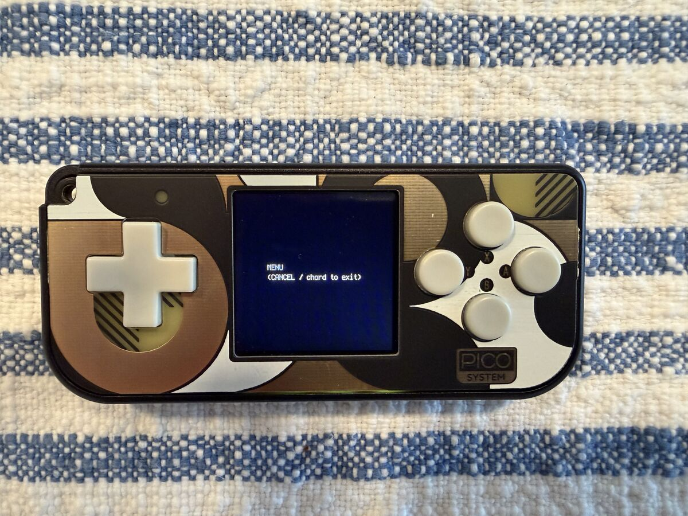 |

**Wait-chord data** (`cd-e3p.15`) — after mashing each binding:


| chord | fired | missed |
|---|---|---|
| **Down + B** | 4 | 0 |
| Up + Down | 0 | 1 |
| Left + Right | 0 | 1 |

`Down + B` lands every time; the opposing-d-pad squeezes never formed a chord
and each logged a miss. Confirms Chris's hunch — narrow to `Down + B` in
`cd-e3p.15`.

## Second playtest — 2026-09-01

First on-device run of the procedural build (generator + `world_from_level`,
combat, message log, SYSTEM diag, stair descent). Deployed the post-`4e5c6d3`
tree.

**Boots, renders, scrolls.** The 64×64 generated level draws correctly — dirt
corridors, flagstone rooms, wall border, the hero on the up-stairs — and the
camera scrolls the full level with the hero clamped to the viewport centre.
Both diag pages work; `A` flips INPUT ⇄ SYSTEM.

**One crash — fixed.** The first monster-on-hero hit threw:

```
File "world.py", line 253, in resolve_attack
AttributeError: 'str' object has no attribute 'capitalize'
```

CircuitPython's `str` has no `.capitalize()` / `.title()` (only
`.upper()`/`.lower()`), and CPython does, so the desktop suite never caught it
(`cd-icp`). Fixed with `world._cap()` + a source-scan regression test
(`test_combat.CircuitPythonStr`). **Not yet re-verified on hardware** — next
deploy.

**RAM — margin has shrunk, watch it.** SYSTEM diag mid-game (depth 1, 4
actors, after opening/closing diag a few times):

| | |
|---|---|
| free | **47 KB** |
| low-water (`free_low`) | **42 KB** |
| used / heap | 111 KB / 159 KB |
| `gc.collect` | 16 ms (n=32) |
| flash free | 15010 KB / 15328 KB |
| env | CircuitPython 10.2.1 · rp2040 |

Still clear of the ~20 KB danger line, but the 2026-08-30 smoke test had
~97 KB free right after construction — the generator (the transient
`_dist_grid` bytearray + int BFS queue), combat, the log ring and the diag
labels have eaten ~50 KB. `cd-dsc.6` (RAM pass) should now be treated as
due, not optional — `bitmap_label` swap + a look at whether the BFS queue can
be capped.

**`frame max` reads ~7.8 s** on the SYSTEM page — almost certainly the
first-frame cost (initial full terrain paint / first `gc.collect`), not a
steady-state stall; `frame` (current) sits at ~30 ms. Worth confirming on the
next run whether descent triggers a second multi-second hitch (regenerate +
repaint). The frame line ghosts in the photo because it repaints ~7×/s over a
slow LCD — not a rendering bug.

**Stair descent:** stepping onto the depth-1 up-stairs correctly shows
*"The way out has sealed behind you."* Down-stairs descent not exercised this
run (didn't reach them).

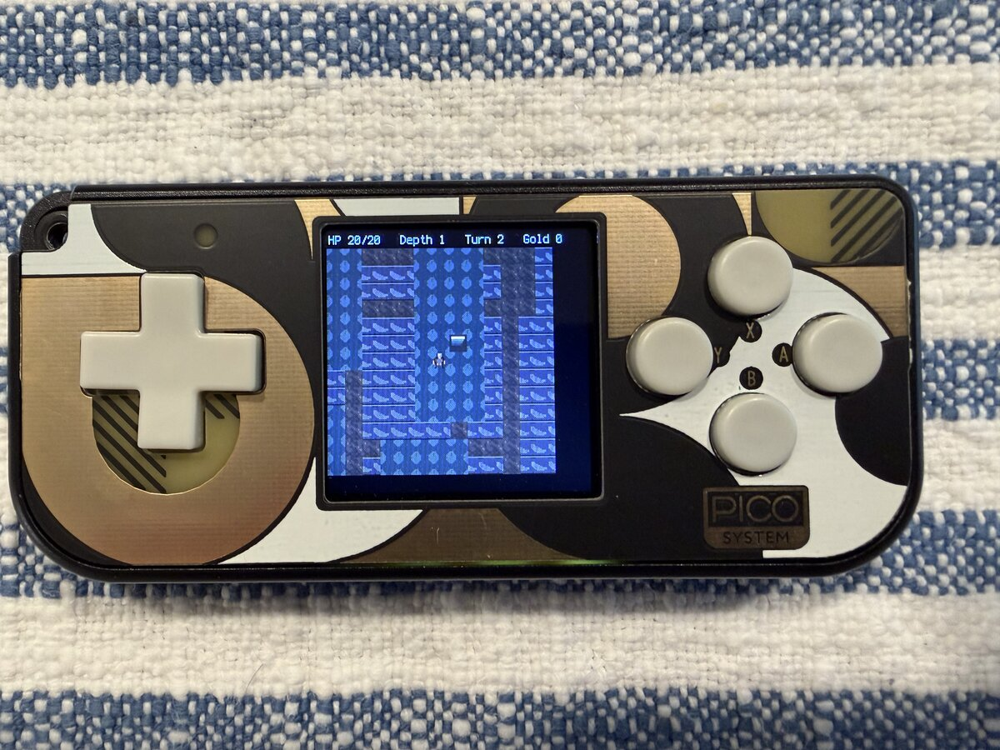
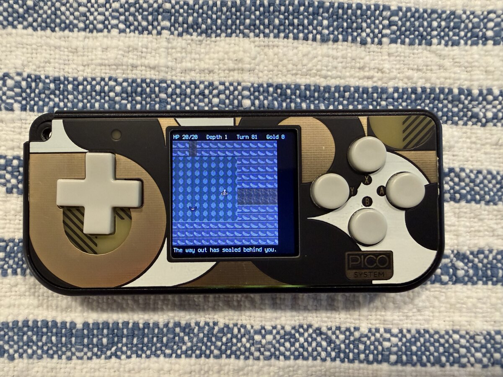

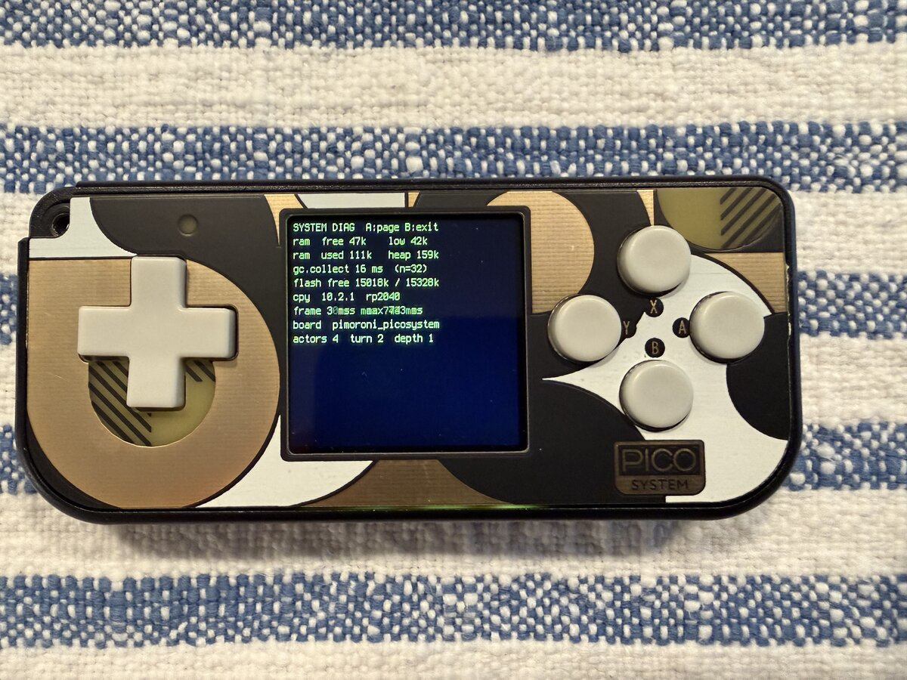
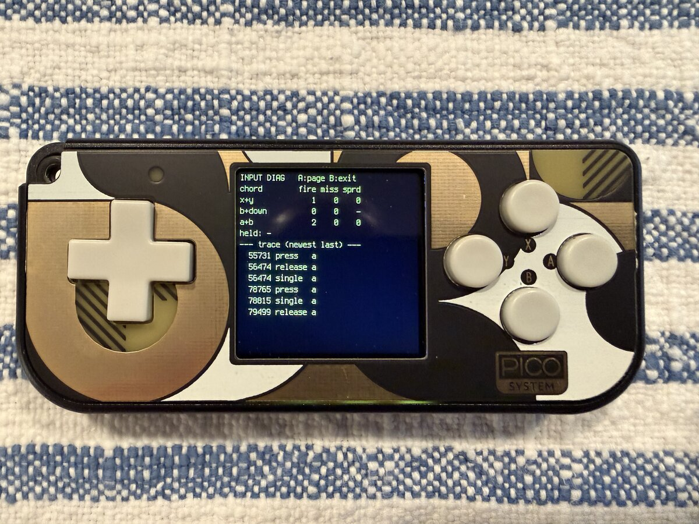

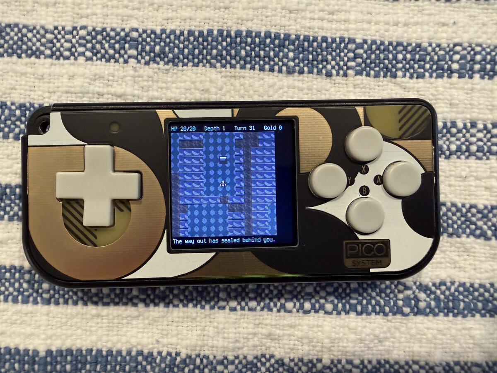


## Third playtest — 2026-09-01 (evening)

Deployed `696440c` — the corpse-follow fix + the first round of memory
mitigations (`cd-yl4` A/B/C: preload all sprite sheets, stop the DIAG label
churn, `gc.collect()` + release the old level before regenerating).

**What held.** Killed 3 monsters with no imageload crash (sheet preload
worked). Corpses stayed put. Opened the SYSTEM diag with no OOM, and
`frame max` dropped from 7783 ms to **790 ms** — the per-frame label rebuild
is gone.

**Still crashed on descent.** Stepping onto the down-stairs to depth 2:

```
File "engine.py", line 80, in _change_level
File "generator.py", line 59, in generate
File "generator.py", line 208, in _connect
File "generator.py", line 169, in _dist_grid
MemoryError: memory allocation failed, allocating 4096 bytes
```

`gc.collect()` frees but **does not compact** — the heap had ~34 KB free
(see below) yet no single contiguous 4 KB run for `_dist_grid`'s BFS buffer.
Fixed by moving `generator._DIST` / `_QUEUE` to module scope, allocated once
at import when the heap is clean, and reused by every `generate()` (and
`_spawn_pool` now samples instead of building a ~1500-tile list). ~12 KB
resident for the process; **needs a redeploy to confirm.**

**RAM after restart + roaming depth 1** (turn 17, 4 actors):

| | |
|---|---|
| free | 41 KB |
| low-water (`free_low`) | **34 KB** |
| used / heap | 118 KB / 159 KB |
| frame / max | 0 ms / 790 ms |

34 KB low-water on depth 1 with nothing unusual going on — the margin is
thin. `cd-yl4` **D** (swap `adafruit_display_text` labels for `bitmap_label`)
and possibly **E** (48×48 levels) are the next levers.

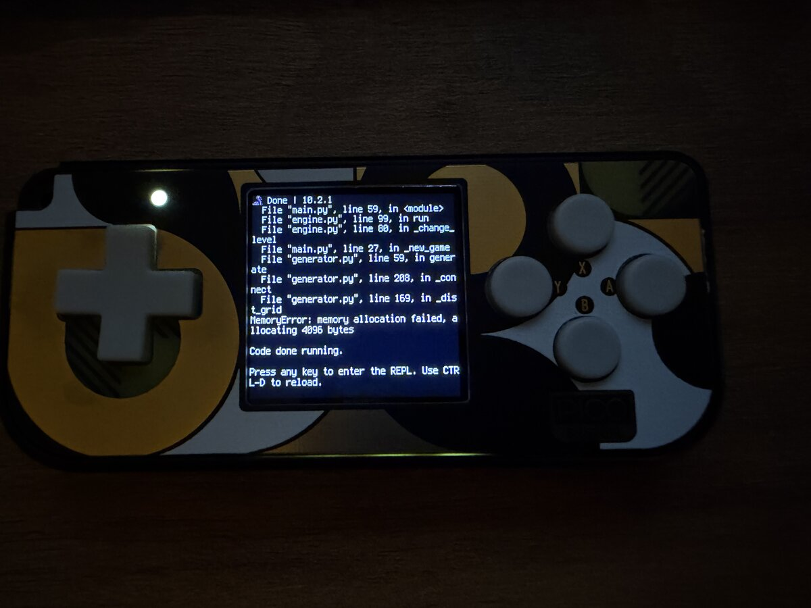
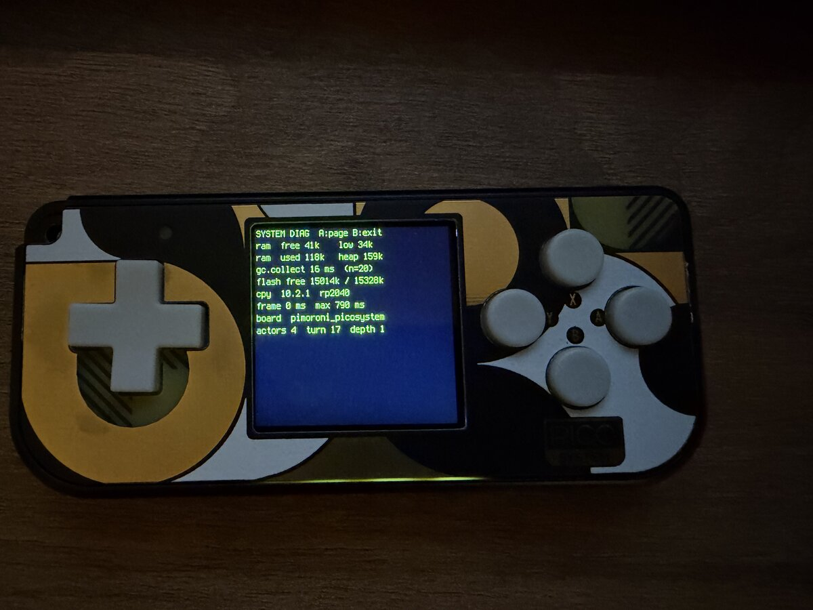
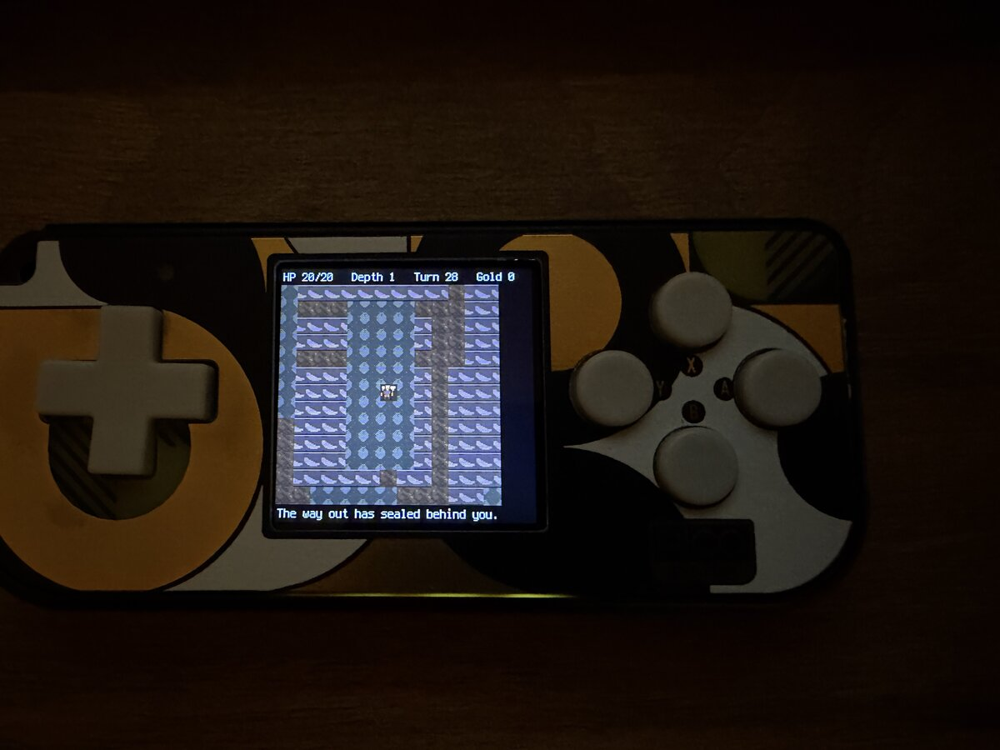

## Fourth playtest — 2026-09-01 (late)

Deployed the working tree with the generator fix + FOV (`cd-e3p.6`) + fog of
war (`cd-oht.6`). **Big step:** descent works — reached **depth 6 at turn
1029** with no crash, and the fog of war reads well (revealed rooms, dark
unexplored rock, corridors opening up as you walk).

**Then diag crashed — but on an 84-byte allocation:**

```
File "modes.py", line 439, in _repaint
File "adafruit_display_text/label.py", line 331, in _update_text
MemoryError: memory allocation failed, allocating 84 bytes
```

84 bytes, right after a `gc.collect()` — the heap wasn't fragmented, it was
**exhausted**. Cause: `PlayMode._paint_status` rebuilds the status label every
turn (the turn counter is in it), and `label.Label` frees and reallocates one
`TileGrid` per glyph (~38) on every `.text` assignment. ~1000 turns of that
churn ate the heap.

Fixes:

- **`util.init_label` → `bitmap_label.Label`** — a single `Bitmap` redrawn in
  place, not a Group of per-glyph TileGrids. (`cd-yl4` D — no longer
  speculative.)
- **Status line is now fixed-width** (`HP %2d/%-2d  Dep %2d  Turn %5d  Gold
  %4d`) so its pixel box never changes and `bitmap_label` reuses its bitmap
  instead of reallocating as the digits roll over.

(This alone wasn't enough — see the fourth playtest below.)

**`bitmap_label` needs `adafruit_ticks`** — the first redeploy hit
`ImportError: no module named 'adafruit_ticks'` at boot. Copied
`adafruit_ticks.mpy` (1.1.7) into `CIRCUITPY/lib/`; `deploy.sh` now checks for
it.

**Then diag OOM'd again** — this time in `bitmap_label._reset_text` allocating
**9108 bytes**: a `bitmap_label` renders its *whole* multi-line string into
one contiguous `Bitmap`, and the diag page is ~10 lines. `ready free` was only
**48 KB** (boot 115 KB → the generator's ~12 KB resident BFS scratch is the
bulk of the drop from 134 KB).

Fixes:

- **DiagMode is now a grid of per-line labels** — 16 small constant-width
  `bitmap_label`s, built lazily on first open and reused (each rewrites its
  own bitmap in place, no big contiguous alloc). Guarded: a low-memory open
  degrades to a partial page instead of crashing the game.
- Every diag `_repaint` path catches `MemoryError` — the debug overlay can
  never take the game down.

`ready free` at 48 KB was thin, so **levels are now 48×48** (`generator.py`:
`LEVEL_W/H = 48`, `ROOM_TARGET 10`, `ROOM_MAX 9`): the BFS scratch drops
12 KB → ~7 KB, the persistent grid 4.6 KB → 2.3 KB, the FOV masks 512 B →
288 B each, and generation is quicker. ~10 rooms per floor, still fully
connected, still scrolls under the 13×13 viewport. Needs a redeploy + a fresh
long run to see where `ready free` and the low-water land now.

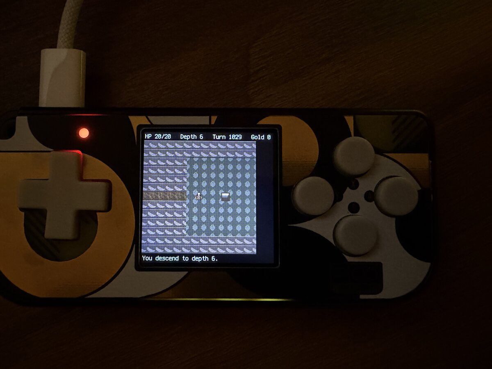
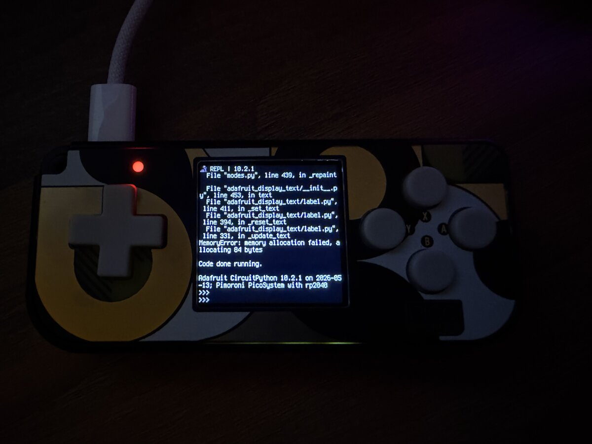

## Fifth playtest — 2026-09-02

Full tree (48×48 levels, per-line diag, `bitmap_label` HUD, fog of war).
**Stable.** Reached **depth 7, turn 1153** — a longer run than the one that
crashed before — with no MemoryError. Combat, descent, fog, the per-line diag
page all render cleanly. The fixed-width status line reads
`HP 17/20 Dep  7  Turn  1153  Gold    0`.

**RAM holds, but the margin is small:**

| | |
|---|---|
| free / low-water | **22 KB / 22 KB** |
| used / heap | 137 KB / 159 KB |
| `gc.collect` | 9 ms (n=319) |
| frame / max | 0 ms / 1770 ms |

`free == free_low == 22 KB` — it hasn't dipped below 22 KB, but it also
hasn't been *lower* than right now, which is consistent with a very slow
ongoing decline over the run (7 descents, ~1150 turns). Playable and no longer
crashing; still worth one more pass on per-turn / per-descent allocation
(`cd-yl4`) before calling it closed. `bitmap_label` for the HUD is the biggest
remaining question — its win over `label.Label` here is churn, not footprint.

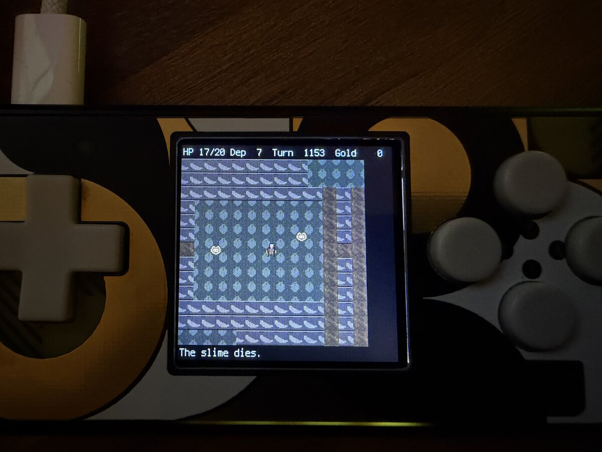
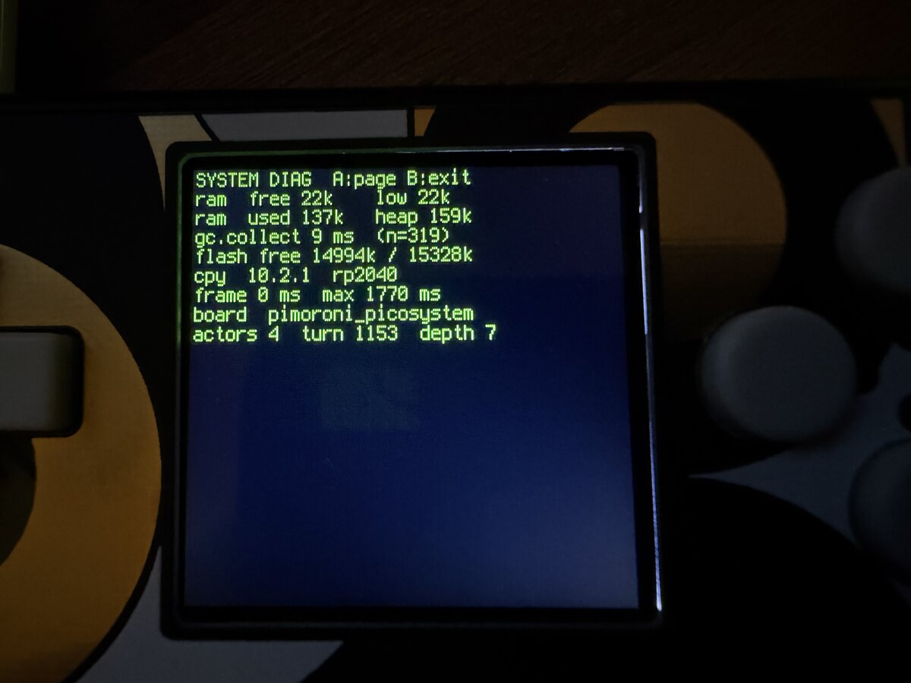

**RAM housekeeping since** (`cd-dsc.6`, not yet re-tested on device):

- diag is **one screen** now, not two half-pages, and `input.py` dropped its
  32-entry per-event trace ring (~2 KB resident + an alloc per keypress) —
  the trace was a wait-chord tuning tool, and that's done.
- `_paint_terrain` writes the TileGrid by flat index (`tg[i]`), not
  `tg[col, row]` — the tuple form built 169 throwaway tuples per turn, and on
  a non-compacting GC that churn is the most likely source of the slow
  decline.
- `engine._change_level` prints `free NNN -> NNN` on every stair traversal —
  watch it descent-over-descent on the next long run to see if a level is
  actually being retained.

## Troubleshooting

- **Blank screen, no serial** — likely still in the UF2 bootloader (check for
  `RPI-RP2` in `ls /Volumes/`), or a hub problem. Reconnect directly.
- **`ImportError` / traceback right after "Ch7 boot"**, or the board rebooted
  mid-`deploy.sh` — a partial copy. Re-run `deploy.sh` (it ejects), then reset.
  If `CIRCUITPY` looks corrupt (missing files, weird names), reformat it from
  the CircuitPython REPL: `import storage; storage.erase_filesystem()` and
  re-deploy (libs too).
- **`ImportError: no module named 'adafruit_...'`** — lib missing or wrong
  bundle major version. `circup --path /Volumes/CIRCUITPY install …`.
- **Traceback on screen** — read it over serial; `Ctrl-C` then
  `import gc; gc.mem_free()` to check for OOM.
- **Buttons do nothing** — board misdetected (see the banner) or a frozen
  `stage`/`ugame` conflict; check `import hardware; hardware.detect().read_buttons()`
  in the REPL while pressing a button.
- **Want live-reload back** (single-file tweaking) — delete `boot.py` from
  `CIRCUITPY`, or in the REPL: `import supervisor; supervisor.runtime.autoreload = True`.
