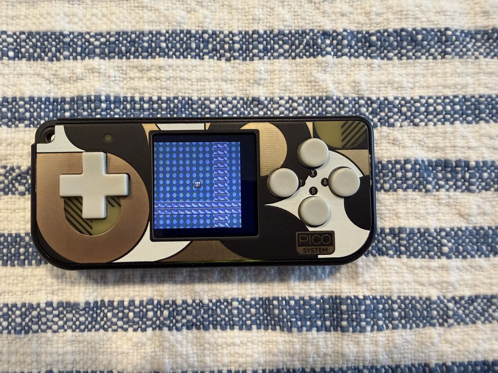
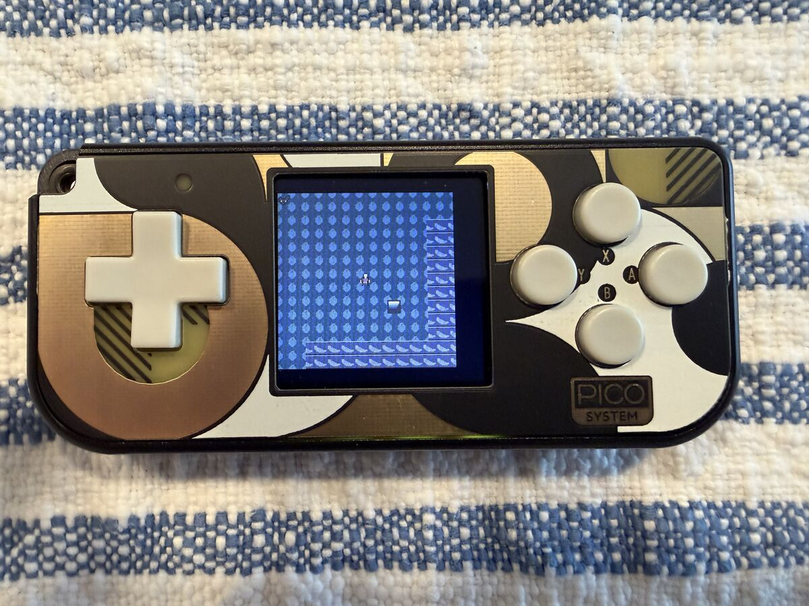
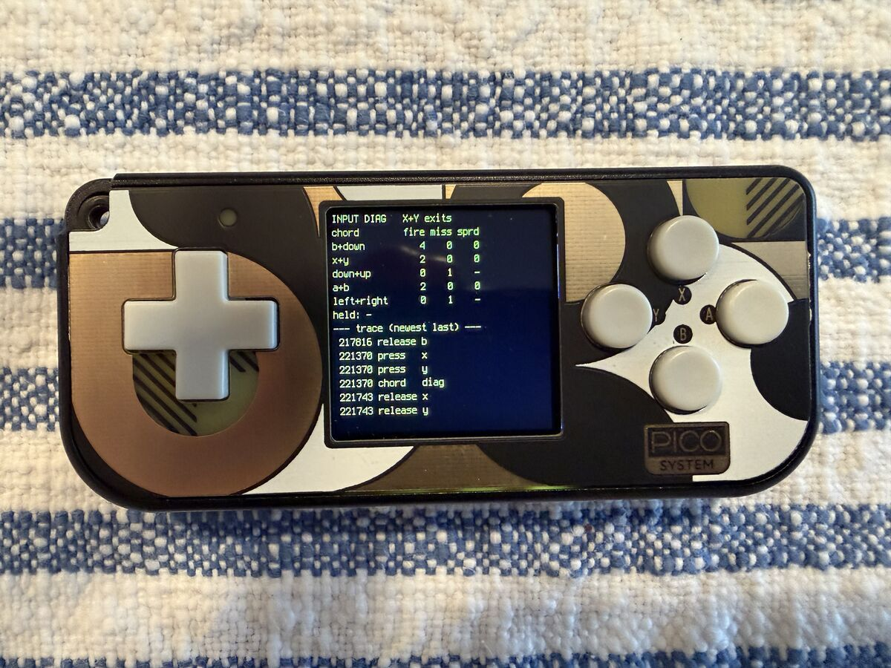

# Chapter 7 — Deploying to the PicoSystem

How to get `Chapter_7/game/` onto a Pimoroni PicoSystem and run it. Board
notes are in `Chapter_6/doc/SYSTEMS.md` (§ *Pimoroni PicoSystem*); this doc is
the Ch7-specific procedure. First target: the `cd-89o.8` smoke test.

## What runs on the device

The **contents of `Chapter_7/game/`** are copied to the root of the `CIRCUITPY`
drive (not into a `game/` subdir — `util.py` loads tiles from `/tiles/`):

```
CIRCUITPY/
  main.py  engine.py  modes.py  input.py  world.py  hardware.py
  util.py  level_loader.py
  tiles/  terrain.bmp creatures.bmp heroes.bmp objects.bmp
          (palette.* / tiles.json copied too; not imported yet)
  lib/  adafruit_display_text/  adafruit_imageload/
```

`doc/`, `tools/`, and `tests/` stay on the desktop.

**No `neopixel` on the PicoSystem.** It has no NeoPixel — its status LED is a
plain RGB LED on 3 PWM pins (`board.LED_R`/`LED_G`/`LED_B` = GPIO 14/13/15),
and CircuitPython defines no `board.NEOPIXEL` for this board.
`hardware._picosystem()` sets `neopixel = None` and never imports the lib, so
`neopixel.mpy` in `lib/` is an unused leftover — harmless to keep, fine to
delete. `deploy.sh` only checks for `adafruit_display_text` and
`adafruit_imageload`.

## Current device state (2026-08-30)

The unit already runs **Chapter 6** with its libs installed, so device setup
is **done** for the first Ch7 test — you just swap the code (see *Deploy*).

Known-good baseline (`downloads/`, gitignored):

| | version |
|---|---|
| CircuitPython (`pimoroni_picosystem`) | **10.2.1** |
| bundle | `adafruit-circuitpython-bundle-10.x-mpy-20260820` |
| `adafruit_display_text` | 5.0.5 |
| `adafruit_imageload` | 1.24.8 |
| `neopixel` | 6.4.2 (unused on the PicoSystem path) |

CP 10.x has every displayio API Ch7 uses (`TileGrid.hidden`,
`Group(x=,y=)`, `Label.anchor_point`/`anchored_position` — all 7.x-era), and
Ch6 running proves `displayio` + `adafruit_imageload` + `adafruit_display_text`
coexist fine with the board's frozen `stage`/`ugame`. So the smoke test is
really just: does the Ch7 code run, and what's the RAM headroom.

## One-time device setup *(already done — reference only)*

1. **CircuitPython.** `downloads/adafruit-circuitpython-pimoroni_picosystem-en_US-10.2.1.uf2`,
   or a fresh build from <https://circuitpython.org/board/pimoroni_picosystem/>.
   Bootloader entry: **hold `X` while pressing the power button** → an
   `RPI-RP2` drive mounts (screen stays blank — normal). Drop the `.uf2` on
   it. Connect straight to the Mac, not through a hub.
2. **Bundle libraries** into `CIRCUITPY/lib/` (from the matching bundle):
   `adafruit_display_text/`, `adafruit_imageload/`. (`neopixel.mpy` is not
   used on this board — see above.)

## Deploy

```
Chapter_7/tools/deploy.sh            # to /Volumes/CIRCUITPY
Chapter_7/tools/deploy.sh /Volumes/CIRCUITPY   # explicit target
```

`rsync -rt --delete` of `game/`'s contents to the drive root. `--delete`
**removes the Chapter 6 files** (`levels/`, `explosions.bmp`, etc.) that
aren't in Ch7's `game/` — that's the Ch6→Ch7 swap. Anchored excludes protect
everything CircuitPython owns (`lib/`, `boot_out.txt`, `settings.toml`) and
the macOS FAT dotfiles. First run: eject and reconnect afterwards, or `sync`,
so the writes flush.

## Watch it boot

```
screen /dev/tty.usbmodem*        # find the exact name with: ls /dev/tty.usbmodem*
```

- `Ctrl-C` → REPL, `Ctrl-D` → restart `main.py`
- Detach: `Ctrl-A` then `d`

`main.py` prints a smoke-test banner:

```
Ch7 boot   board=pimoroni_picosystem  free=NNNNNN
Ch7 ready  free=NNNNNN  X+Y=diag  A+B=menu
```

Then the screen shows the Option-G layout: a status band on top, the 13×13
map viewport (hero centred, flagstone floor, a wall border + interior cross),
the icon-rail strip on the right, a message band on the bottom.

## What to check (cd-89o.8)

| | |
|---|---|
| boots, no traceback | banner prints twice; screen renders |
| RAM headroom | `free=` after "ready" — want comfortably > 20 KB |
| board detect | banner says `board=pimoroni_picosystem` (else `hardware.detect()` fell through to `_generic()` and buttons are dead) |
| camera | hold a d-pad direction → the map scrolls, hero stays centred |
| off-view culling | the second test monster (bottom-right of the room) only appears when you scroll to it |
| `X`+`Y` together | switches to the DIAG page — live `chord_stats` table, held buttons, input trace |
| `X`+`Y` again / `B` | back to the game |
| `A`+`B` together | the MENU stub label; `B` exits |
| wait chord | `Down+B` together → the `chord_stats` `b+down` row's `fired` climbs (`Left+Right` / `Up+Down` were dropped after the first run — see below) |

## First smoke test — 2026-08-30

Passed. The Option-G scene renders, the camera scrolls and keeps the hero
centred, and both overlay modes work.

```
Ch7 boot   board=pimoroni_picosystem  free=146896
Ch7 ready  free=99616  X+Y=diag  A+B=menu
```

**RAM:** ~144 KB free after imports; `engine.Game(...)` construction costs
~47 KB (3 tile sheets, displayio groups, the 13×13 grid, actor sprites, the
mode stack) leaving **~97 KB free heap**. Comfortable for now — the real
64×64 level adds only ~3 KB (the terrain TileGrid stays viewport-sized), FOV
+ a full monster/item roster maybe ~15 KB more. `cd-dsc.6` does the proper
RAM pass; an easy win noted there is swapping the `adafruit_display_text`
labels for the lighter `bitmap_label`.

| | |
|---|---|
|  |  |
|  |  |

**Wait-chord data** (`cd-e3p.15`) — after mashing each binding:



| chord | fired | missed |
|---|---|---|
| **Down + B** | 4 | 0 |
| Up + Down | 0 | 1 |
| Left + Right | 0 | 1 |

`Down + B` lands every time; the opposing-d-pad squeezes never formed a chord
and each logged a miss. Confirms Chris's hunch — narrow to `Down + B` in
`cd-e3p.15`.

## Troubleshooting

- **Blank screen, no serial** — likely still in the UF2 bootloader (check for
  `RPI-RP2` in `ls /Volumes/`), or a hub problem. Reconnect directly.
- **`ImportError: no module named 'adafruit_...'`** — lib missing or wrong
  bundle major version.
- **Traceback on screen** — read it over serial; `Ctrl-C` then
  `import gc; gc.mem_free()` to check for OOM.
- **Buttons do nothing** — board misdetected (see the banner) or a frozen
  `stage`/`ugame` conflict; check `import hardware; hardware.detect().read_buttons()`
  in the REPL while pressing a button.
