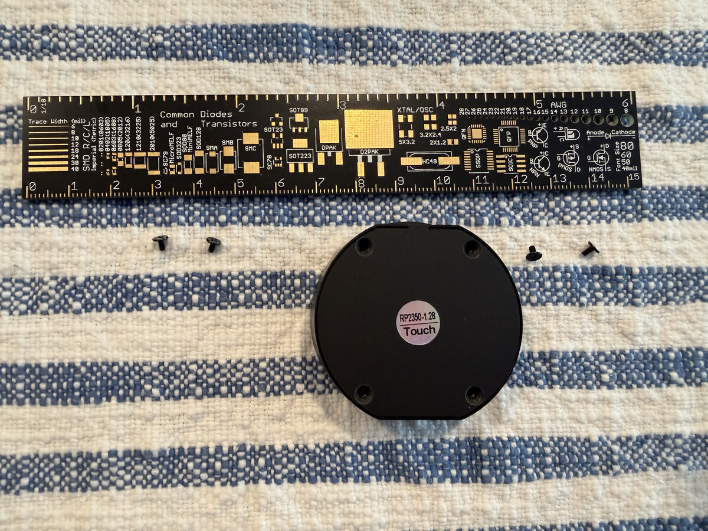
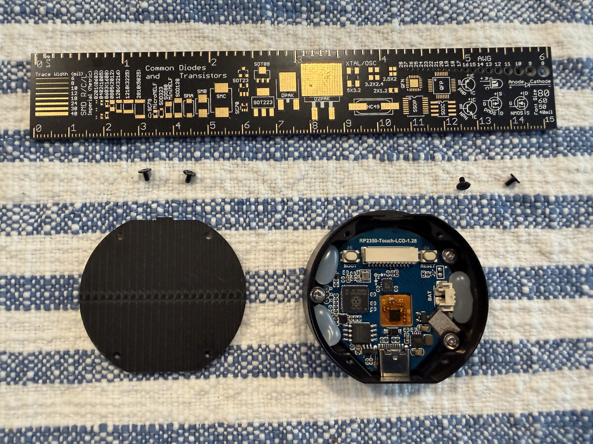
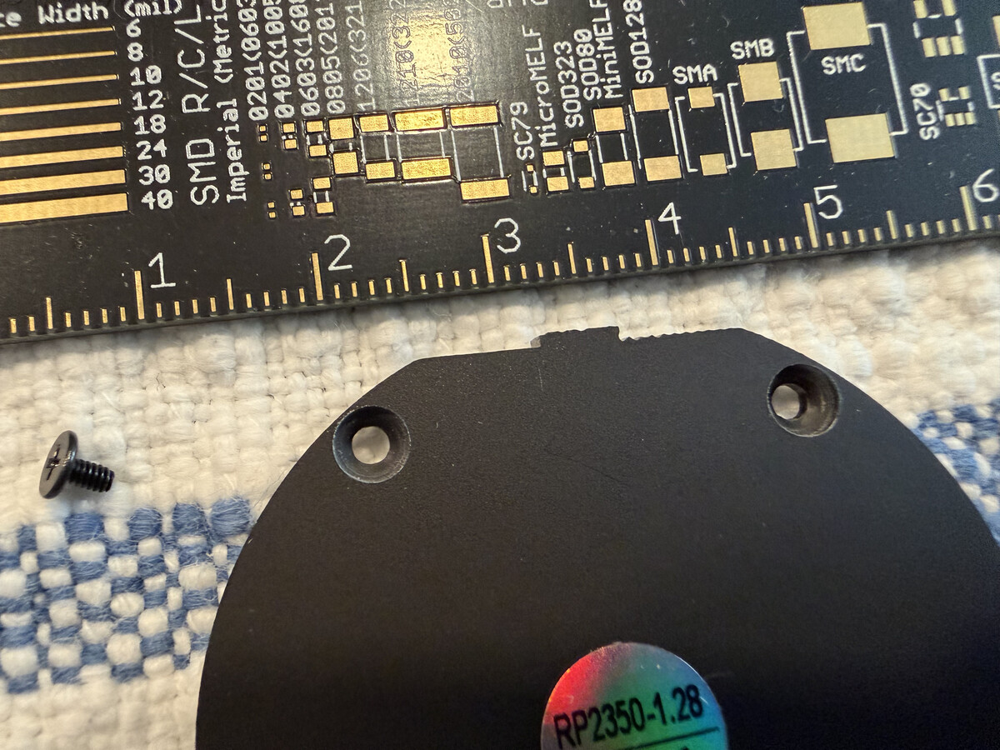
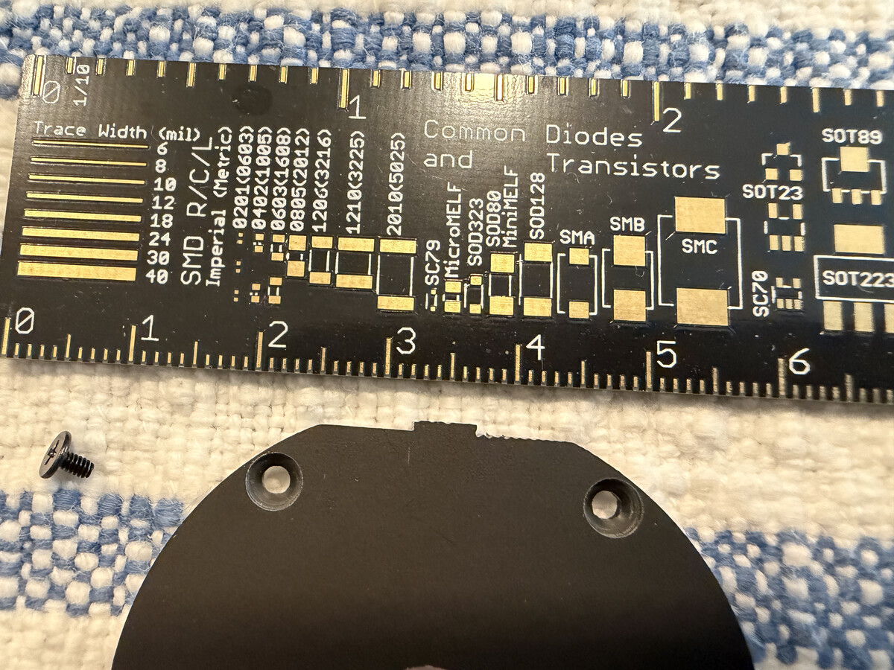

# Chapter 8 — Custom backplate / case (`cd-bp3.6`)

Reference photos and measurement notes for a custom 3D-printed backplate:
more interior room for a bigger battery than the stock one fits, reusing the
same 4 screws, plus BOOT/RESET button access (see `cd-bp3.6` for the full
requirements, and `doc/HARDWARE.md` "Power / battery" for why button access
alone doesn't cover the I2C-bus-wedge recovery case).

## Reference photos — 2026-09-04

## Design note from Chris (2026-09-04)

The stock backplate is uniformly **flat/thin** — that's how the 4 screws
(short, reaching fixed-height standoffs on the board) end up flush. If the
new backplate just adds depth everywhere for more battery room, the screws
won't reach the standoffs anymore. So the 4 mounting points need to stay
**recessed bosses** at the original stock depth (screw holes on small raised
pads reaching in to the same height the stock screws expect), while the
surrounding shell bulges outward around them for the bigger cavity. Capture
this as a real constraint in the `.scad` model, not just an afterthought.

## Measurement checklist (calipers — pending, target: this weekend)

From the chat discussion: LiDAR/photogrammetry (Scaniverse/Polycam on the
iPhone 17 Pro) is fine for a general sense of shape but not trustworthy for
the screw-hole tolerances that matter here. Filling this in with real
caliper numbers once Chris has borrowed one.

**Screw holes**
- [ ] Hole diameter (all 4)
- [ ] Bolt-circle diameter (or adjacent/diagonal hole-to-hole distances if
      not evenly spaced)
- [ ] Distance from each hole to the nearest board edge
- [ ] Screw diameter and length
- [ ] Standoff height (how far the screw threads into the board)

**Board & stock backplate**
- [ ] Overall board diameter (or length×width)
- [ ] PCB thickness
- [ ] Stock backplate: outer dimensions, wall thickness, internal cavity
      depth (the number the new design needs to beat)
- [ ] Total assembled thickness, front glass to back of case

**Buttons (BOOT/RESET) — for extender design**
- [ ] Each button's X/Y position relative to a fixed reference point
- [ ] Button diameter, recess depth below the board's top surface, and
      travel distance

**Ports/connectors the case must clear**
- [ ] USB-C port position + size
- [ ] 6-pin SH1.0 GPIO connector position + size
- [ ] MX1.25 battery connector position + size
- [ ] Anything else (speaker hole, SD slot, etc.)

**Battery (once purchased)**
- [ ] Length × width × thickness — the actual driver of how much bigger the
      cavity needs to be
