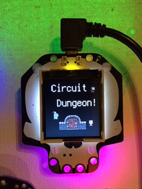

# CircuitDungeon

This is a series of experiments in making tile-based dungeon crawl type games for [CircuitPython](https://circuitpython.org) devices with screens (like the [HalloWing](https://www.adafruit.com/product/3900) pictured above) using Creative Commons licensed artwork.

* [Chapter 0 - The Rough Beginning](Chapter_0)
* [Chapter 1 - The Hallowing!](Chapter_1)
* [Chapter 2 - Yet Another Game Concept....](Chapter_2)
* [Chapter 3 - The Dad Joke - for PyBadge](Chapter_3)
* [Chapter 4 - The Rabbit Hole](Chapter_4)
